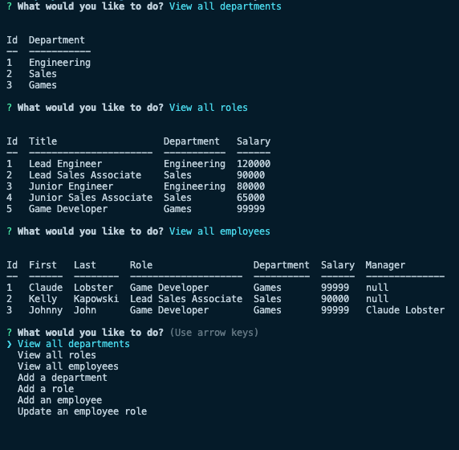

# Employee Tracker

  ## Table of Contents
  * [Description](#description)
  * [Installation](#installation)
  * [Usage](#usage)
  * [Video Walkthrough](#video-walkthrough)
  * [Contributing](#contributing)
  * [Questions](#questions)

  ## License 
This project is covered under the MIT License.
    
  
  
  Click on the badge to see **MIT License** details.

  ## Description
  - Command Line Interface application, allowing the user to keep track of departments, roles, employees, and updating employee roles.

  

  ## Installation
  - Run an 'npm install' command in the terminal.  
  
  - You will need to create a .env file in the repository that matches the connection.js variables.  
  
    * These will be used to access your MySQL shell.

  ## Usage
  - Use when wanting to keep track of business personnel.

  ## Video Walkthrough
  - Link to the [video walkthrough](https://drive.google.com/file/d/1J9UFgPdh2hIihNdMDATZkbmwm0lM8Elc/view?usp=sharing)

  ## Contributing
 -  Reach out to me with suggestions for how you would like to improve the app.

  ## Questions
  
  [github.com/jeffMullen](https://github.com/jeffMullen)

  If you have additional questions, feel free to reach me at jeffmullendev@gmail.com
